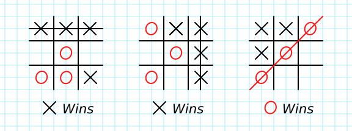

# Tic tac toe

> In this project, the student builds a Tic Tac Toe game. The main goal is to put into practice the main concepts of Object-Oriented Programming. Particularly, classes and access to their attributes.

🎮
**This project was build with ruby 2.7.2p137 (2020-10-01 revision 5445e04352) [x64-mingw32] and ruby 2.7.2p137 (2020-10-01 revision 5445e04352) [x86_64-darwin15]**

The game is loaded and played entirely on the command prompt/terminal of your computer system. Kindly follow the instructions below to play it. 🙂

## Built With

- Ruby

## Introduction

Welcome to Tic Tac Toe

    This is the classic game where you have to mark with an X or 0 your position on the board.

    To play, each player will have to select a position in the grid by choosing a number from 1 to 9.
    Each number corresponds to one of the positions in the grid. You can choose any position that is empty.
    You select your move by typing the number that corresponds to the position you wish to mark.

    The first player to make a line of three consecutive marks wins the game.
    The line can be horizontal, vertical or diagonal.

The player who makes a straight line with 3 marks wins!

## Instructions

1. Open your terminal or command prompt.
2. If you don't have git installed in your system, skip this step and go to step 3. If you do have git installed in your system, clone this repository to your computer in any directory you want by copying this text into your command prompt/terminal: `git clone https://github.com/vichuge/rb-tic-tac-toe.git`. Now go to step 6.
3. If you don't have git installed in your system, you can just download the game files. To do this, click on the green button that says "**Clone**"
4. You will see a dropdown menu. Click on "**Download ZIP**".
5. Go to the directory where you downloaded the **ZIP file** and open it. Extract its contents to any directory you want in your system.
6. If you are not in your system terminal/command prompt already, please open it and go to the directory where you cloned the remote repository or extracted the game files.
7. Run the game by typing the command `./bin/main.rb`.
8. In case the game doesn't load, type `ruby bin/main.rb`
9. Play the game!

## Live Demo

- Repl live demo: [Link](https://repl.it/@StarSheriff2/Tic-Tac-Toe#main.rb)

## Authors

👤 **Victor Pacheco**

- GitHub: [@vichuge](https://github.com/vichuge)
- LinkedIn: [LinkedIn](https://www.linkedin.com/in/victor-pacheco-7946aab2/)

👤 **Arturo Alvarez**

- GitHub: [@StarSheriff2](https://github.com/StarSheriff2)
- Twitter: [@Turo_83](https://twitter.com/Turo_83)
- LinkedIn: [Carlos Alvarez](https://www.linkedin.com/in/carlosalvarezveroy/)

👤 **Miguel Ricaño**

- Github: [@mricanho](https://github.com/mricanho)
- Linkedin: [Miguel Ricaño](https://www.linkedin.com/in/mricanho/)

## 🤝 Contributing

Contributions, issues, and feature requests are welcome!

Feel free to check the [issues page](https://github.com/vichuge/ruby_enumerables/issues).

## Show your support

Give a ⭐️ if you like this project!

## 📝 License

This project is [MIT](https://github.com/vichuge/ruby_enumerables/blob/main/LICENSE) licensed, thanks.
